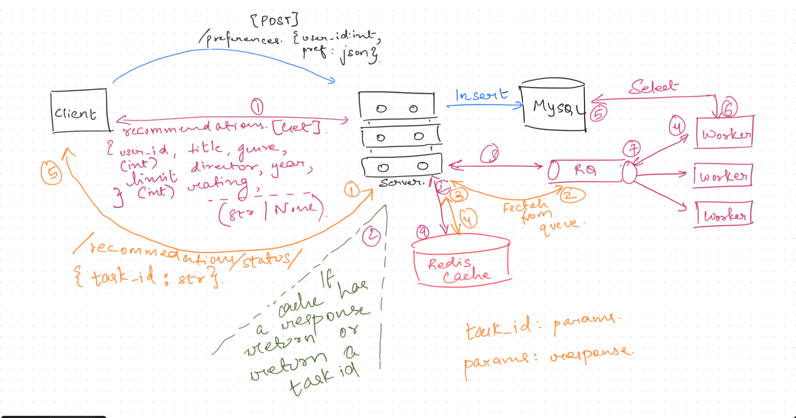

# Movies API Application

## Overview
The Movies API Application is a Flask-based backend system designed to manage user preferences, movie data, and generate recommendations. It integrates MySQL for persistent storage and Redis for caching and task queuing, providing a performant and scalable architecture.

---

## Features

1. **User Management**
   - Manage user accounts and preferences.

2. **Movie Database**
   - Store, retrieve, and query movie information such as title, genre, director, year, and rating.

3. **Recommendations**
   - Generate personalized movie recommendations based on user preferences.

4. **Caching and Task Queuing**
   - Use Redis for caching frequent queries and queuing long-running tasks.

---

## Prerequisites

- Python 3.8+
- MySQL 8.0+
- Redis
- Required Python libraries (listed in `requirements.txt`)

---

## Installation

### 1. Clone the repository
```bash
git clone <repository_url>
cd movies_api
```

### 2. Set up the MySQL database

#### Create the database:
```sql
CREATE DATABASE movies_api;
USE movies_api;
```

#### Import the schema:
```bash
mysql -u root -p movies_api < database/init.sql
mysql -u root -p movies_api < database/create_tables.sql
```

### 3. Insert initial movie data
```bash
python insert_movies.py
```

### 4. Install dependencies
```bash
pip install -r requirements.txt
```

### 5. Run the server
```bash
python run.py
```

The API server will start on `http://127.0.0.1:5001`.

---

## System Architecture

The system architecture for the Movies API Application involves several key components:

1. **Client**: Sends API requests and receives responses.
2. **Server**: Processes incoming requests, interacts with the database, and handles caching.
3. **MySQL Database**: Stores user data, movie information, and preferences.
4. **Redis**: Acts as a caching layer and task queue.
5. **Workers**: Handle background tasks such as generating movie recommendations.

### Workflow Diagram



### Explanation of Workflow
1. **Client Request**:
   - The client sends a `POST` request to the `/preferences` endpoint with user preferences.
   - The server validates and stores the preferences in the database.
   
2. **Recommendation Request**:
   - A `GET` request is made to `/recommendations` to fetch personalized recommendations.
   - If a cached response exists, it is returned immediately; otherwise, a task ID is generated.

3. **Task Queue**:
   - Tasks are enqueued in Redis Queue (`rq`), and workers process the tasks asynchronously.

4. **Fetching Data**:
   - Workers query the MySQL database to fetch relevant movie data based on the user's preferences.

5. **Caching and Status Update**:
   - The recommendation results are cached in Redis, and the task status is updated.
   - Clients can poll the `/recommendations/status` endpoint to check task progress.

6. **Response Delivery**:
   - Once the recommendations are ready, they are retrieved from the cache and sent back to the client.

---

## API Endpoints

### **1. POST `/preferences`**
Save user preferences.

#### Request Body:
```json
{
    "user_id": 1,
    "preferences": {
        "genre": "Action",
        "year": [2021, 2022],
        "rating": [7.5, 9.0]
    }
}
```
#### Response:
```json
{
    "message": "Preferences updated successfully",
    "data": { ... }
}
```

### **2. GET `/recommendations`**
Fetch movie recommendations.

#### Query Parameters:
- `user_id` (required)
- `genre`
- `year`
- `rating`
- `limit`

#### Example:
`GET /recommendations?user_id=1&genre=Action&limit=5`

#### Response:
```json
{
    "task_id": "<task_id>",
    "message": "Recommendations are being calculated!"
}
```

### **3. GET `/recommendations/status`**
Check the status of a recommendation task.

#### Query Parameters:
- `task_id` (required)

#### Response:
- `queued`
- `processing`
- `completed`
- `failed`

---

## Development Notes

### Database Schema

#### Users Table:
| Field         | Type         | Notes                      |
|---------------|--------------|----------------------------|
| `id`          | INT (PK)     | Auto-increment primary key |
| `email`       | VARCHAR(255) | Unique user email          |
| `passwd`      | VARCHAR(60)  | Encrypted password         |

#### Movies Table:
| Field     | Type         | Notes |
|-----------|--------------|-------|
| `id`      | INT (PK)     |       |
| `title`   | VARCHAR(255) |       |
| `genre`   | VARCHAR(150) |       |
| `director`| VARCHAR(150) |       |
| `year`    | YEAR         |       |
| `rating`  | FLOAT        |       |

#### Preferences Table:
| Field          | Type    | Notes                       |
|----------------|---------|-----------------------------|
| `user_id`      | INT     | Foreign key to Users table  |
| `preferences`  | JSON    | User preferences JSON blob  |

---

## Caching and Task Queue

- **Redis** is used for:
  - Caching movie queries.
  - Storing task results and statuses.

- **rq** (Redis Queue) is used to manage asynchronous tasks like recommendation generation.

---

## Additional Scripts

### `insert_movies.py`
Populates the `movies` table with sample data. Edit the `movies` list in the script to add more entries.

---

## Contributing
1. Fork the repository.
2. Create a feature branch.
3. Commit your changes.
4. Push to the branch.
5. Submit a pull request.

---

## License
This project is licensed under the MIT License.
